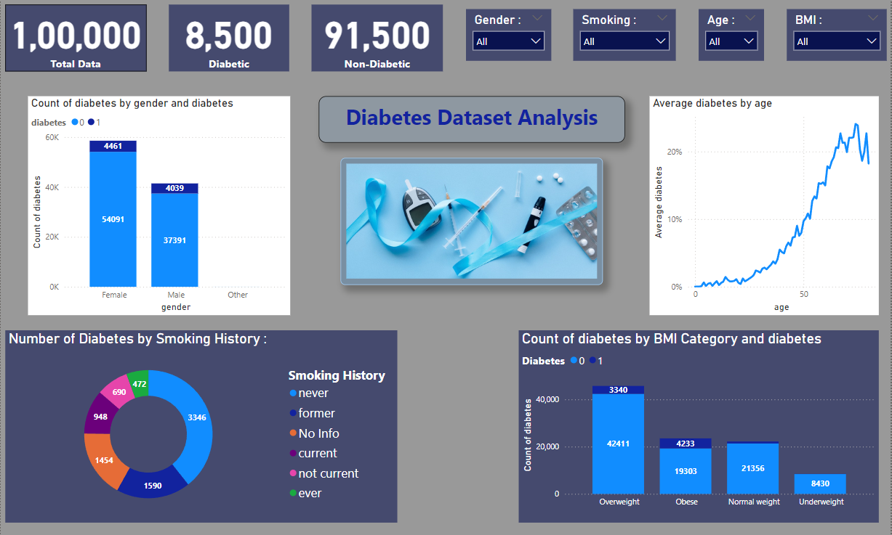
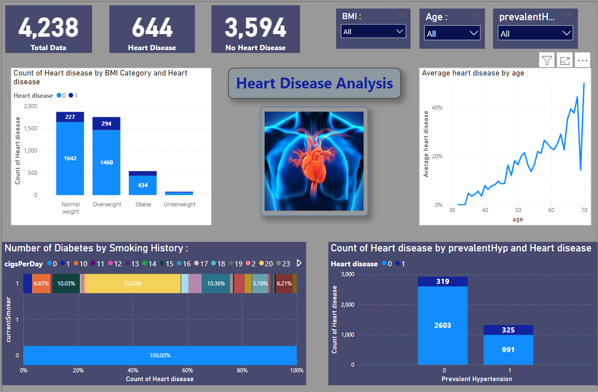
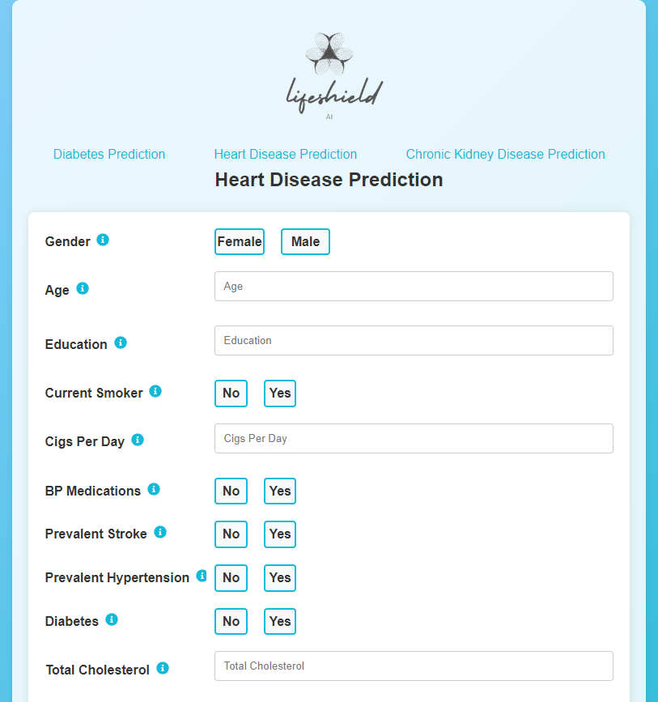
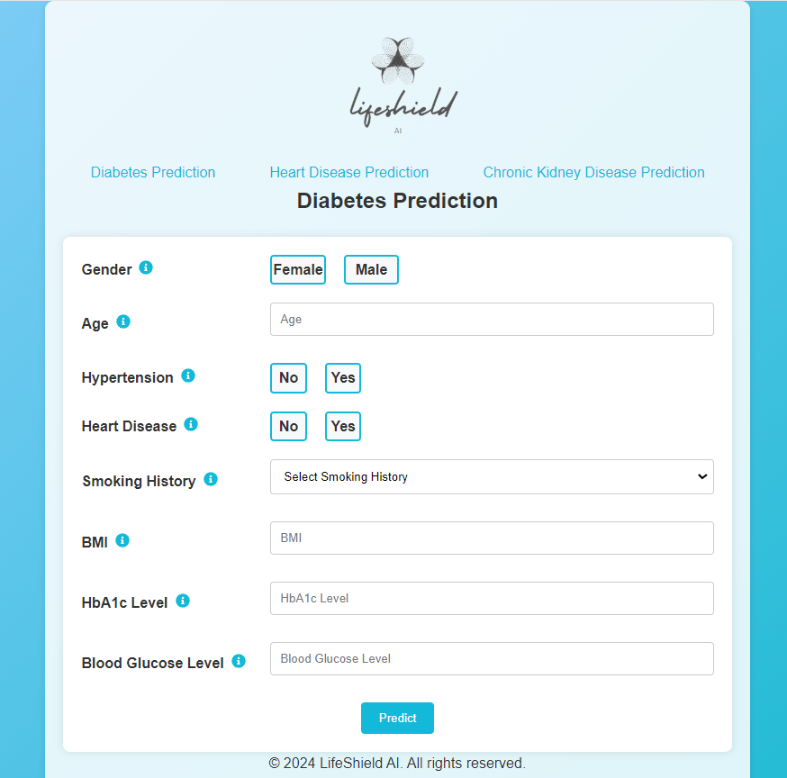

# 🧠 Chronic Disease Prediction System

A machine learning–powered platform designed to detect **heart disease**, **diabetes**, and **kidney disease** at early stages, helping improve preventive healthcare and patient outcomes.

---

## 🔍 Overview

This project integrates medical datasets and lifestyle indicators to predict chronic diseases using advanced machine learning models. It features a ReactJS-based frontend, a Python backend, and a Power BI dashboard for data visualization and insights.

---

## 🚀 Key Features

- **Multi-Disease Prediction**: Detects heart disease, diabetes, and kidney disease using 6 ML algorithms
- **Full-Stack App**: Built with ReactJS (frontend), Python (backend), and Power BI (visual dashboard)
- **Data-Rich Insights**: Uses patient demographics, medical history, and lifestyle data
- **Personalized Healthcare**: Offers early detection and decision support to reduce treatment cost

---

## 🛠 Tech Stack

| Layer       | Tools / Tech |
|-------------|--------------|
| Frontend    | ReactJS |
| Backend     | Python, Flask |
| ML Models   | scikit-learn, Pandas, NumPy |
| Visualization | Power BI |
| Datasets    | Kaggle, UCI |

---

## 🎯 Objectives

- Enhance preventive healthcare through early detection  
- Improve patient outcomes with accurate ML predictions  
- Reduce healthcare costs via timely interventions  

---

## 📁 Getting Started

### 1. 🔧 Clone the Repository
```bash
git clone https://github.com/pateladiti0401/Chronic_disease_prediction.git
```
### 2. ⚙️ Backend Setup (Python)
```bash
cd backend
pip install -r requirements.txt
python predict_diabetes.py
python predict_heart.py
python predict_kidney.py
python app.py  # start Flask server
```
### 3. 🌐 Frontend Setup (React)
```bash
cd frontend
npm install
npm start
```
### 4. 📊 Power BI Dashboard
Open the .pbix file provided in the repository

Explore prediction results and visual trends

---

## 🧪 Datasets

🫀 [Heart Disease – Kaggle](https://www.kaggle.com/datasets/naveengowda16/logistic-regression-heart-disease-prediction)

🩸 [Diabetes – Kaggle](https://www.kaggle.com/datasets/iammustafatz/diabetes-prediction-dataset)

🧪 [Kidney Disease – UCI](https://archive.ics.uci.edu/dataset/336/chronic+kidney+disease)

---

## 🖼️ Screenshots


### 🔹 Power BI Dashboards

#### 🩸 Diabetes Dashboard


#### 🫀 Heart Disease Dashboard


---

### 🔹 Lifeshield AI Web Interface

#### 🫁 Heart Disease Form


#### 🧪 Diabetes Disease Form


---

##  📌 Status

✅ Completed | 🎯 Actively maintained

---

## 📫 Contact

Aditi Patel
📧 pateladiti542@gmail.com
